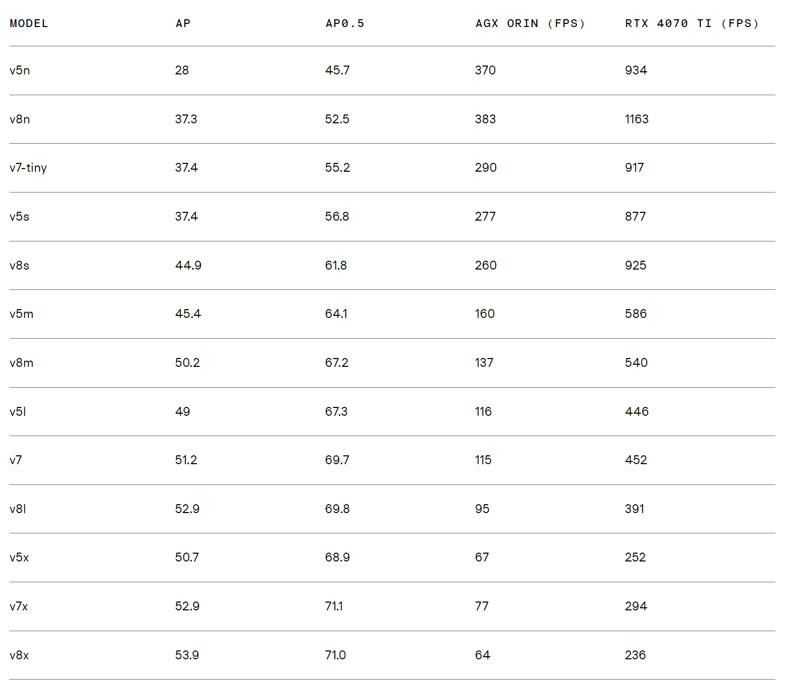

### 모델 간 비교

[참고자료](https://www.stereolabs.com/en-kr/blog/performance-of-yolo-v5-v7-and-v8)

- 모든 v8모델들이 v5보다 동일 런타임에서 4에서 9정도 mAP 향상된 성능을 보인다.
- v5l와 v5x는 v8m, v8l이 mAP와 속도 측면에서 모두 넘어섰다.
- v8n이 정확도와 속도면에서 가장 가벼우면서 최고의 모델이다.
- YOLO v8모델은 1280 해상도를 지원하지 않는다. yolo v7이 더 느리긴 하지만 고해상도 측면에서는 여전히 최고의 선택

### 결론

- yolo v5, 7, 8 모두 Jetson orin 플랫폼에서 준수한 성능을 보였지만, 실험 결과에 따르면 V8이 셋 중 가장 좋은 성능을 보였다.
- YOLO v8은 YOLO v5와 비교했을 때 모든 변형(모델)에서 COCO 데이터셋의 mAP(Mean Average Precision, 평균 정밀도)를 개선하면서도, Orin과 RTX 4070 Ti에서 유사한 실행 시간을 유지합니다.
- 빠르고 신뢰할 수 있는 객체 탐지 프레임워크를 찾고 있다면, YOLO v8이 적합한 선택일 수 있습니다.

## YOLO 모형 하이퍼파라미터

|      인수       | 기본값 | 설명                                                                                                                                                                                                   |
| :-------------: | :----: | ------------------------------------------------------------------------------------------------------------------------------------------------------------------------------------------------------ |
|      model      |  None  | 학습할 모델 파일을 지정합니다. 다음 중 하나의 경로를 허용합니다. .pt 사전 학습된 모델 또는 .yaml 구성 파일. 모델 구조를 정의하거나 가중치를 초기화하는 데 필수적입니다.                                |
|      data       |  None  | 데이터 집합 구성 파일의 경로(예:, coco8.yaml). 이 파일에는 학습 및 유효성 검사 데이터 경로, 클래스 이름, 클래스 수 등 데이터 세트별 파라미터가 포함되어 있습니다.                                      |
|     epochs      |  100   | 총 훈련 에포크 수입니다. 각 에포크는 전체 데이터 세트에 대한 전체 패스를 나타냅니다. 이 값을 조정하면 학습 기간과 모델 성능에 영향을 줄 수 있습니다.                                                   |
|      time       |  None  | 최대 훈련 시간(시간). 설정하면 이 값은 epochs 인수를 사용하여 지정된 시간 후에 트레이닝을 자동으로 중지할 수 있습니다. 시간 제약이 있는 교육 시나리오에 유용합니다.                                    |
|    patience     |  100   | 훈련을 조기 중단하기 전에 검증 지표의 개선 없이 기다려야 하는 에포크 수입니다. 성능이 정체될 때 훈련을 중단하여 과적합을 방지합니다.                                                                   |
|      batch      |   16   | 배치 크기, 세 가지 모드: 정수로 설정(예, batch=16), 60% GPU 메모리 사용률의 자동 모드(batch=-1) 또는 지정된 사용률 비율의 자동 모드(batch=0.70).                                                       |
|      imgsz      |  640   | 학습을 위한 목표 이미지 크기입니다. 모든 이미지는 모델에 입력되기 전에 이 크기로 조정됩니다. 모델 정확도와 계산 복잡도에 영향을 줍니다                                                                 |
|      save       |  True  | 훈련 체크포인트와 최종 모델 가중치를 저장할 수 있습니다. 훈련 또는 모델 배포를 재개할 때 유용합니다.                                                                                                   |
|   save_period   |   -1   | 모델 체크포인트 저장 빈도(에포크 단위로 지정)입니다. 값이 -1이면 이 기능이 비활성화됩니다. 긴 훈련 세션 동안 중간 모델을 저장할 때 유용합니다.                                                         |
|      cache      | False  | 메모리에서 데이터 세트 이미지의 캐싱을 활성화합니다(True/ram), 디스크(disk) 또는 비활성화(False). 메모리 사용량을 늘리는 대신 디스크 I/O를 줄여 훈련 속도를 향상시킵니다.                              |
|     device      |  None  | 교육용 계산 장치를 지정합니다: 단일 GPU (device=0), 다중 GPU(device=0,1), CPU (device=cpu) 또는 애플 실리콘의 경우 MPS (device=mps).                                                                   |
|     workers     |   8    | 데이터 로딩을 위한 워커 스레드 수(당 RANK 다중GPU 훈련인 경우). 데이터 전처리 및 모델에 공급하는 속도에 영향을 미치며, 특히 다중GPU 설정에서 유용합니다.                                               |
|     project     |  None  | 교육 결과물이 저장되는 프로젝트 디렉토리의 이름입니다. 다양한 실험을 체계적으로 저장할 수 있습니다.                                                                                                    |
|      name       |  None  | 트레이닝 실행의 이름입니다. 프로젝트 폴더 내에 트레이닝 로그 및 결과물이 저장되는 하위 디렉터리를 만드는 데 사용됩니다.                                                                                |
|    exist_ok     | False  | True로 설정하면 기존 프로젝트/이름 디렉터리를 덮어쓸 수 있습니다. 이전 결과물을 수동으로 지울 필요 없이 반복적인 실험을 할 때 유용합니다.                                                              |
|   pretrained    |  True  | 사전 학습된 모델에서 학습을 시작할지 여부를 결정합니다. 가중치를 로드할 특정 모델에 대한 부울 값 또는 문자열 경로일 수 있습니다. 학습 효율성과 모델 성능을 향상시킵니다.                               |
|    optimizer    | 'auto' | 교육용 옵티마이저 선택. 옵션은 다음과 같습니다. SGD, Adam, AdamW, NAdam, RAdam, RMSProp 등 또는 auto 를 사용하여 모델 구성에 따라 자동으로 선택할 수 있습니다. 컨버전스 속도와 안정성에 영향을 줍니다. |
|     verbose     | False  | 교육 중에 자세한 로그와 진행 상황 업데이트를 제공하는 상세 출력을 활성화합니다. 교육 프로세스를 디버깅하고 면밀히 모니터링하는 데 유용합니다.                                                          |
|      seed       |   0    | 트레이닝을 위한 무작위 시드를 설정하여 동일한 구성으로 실행할 때 결과의 재현성을 보장합니다.                                                                                                           |
|  deterministic  |  True  | 결정론적 알고리즘 사용을 강제하여 재현성을 보장하지만 비결정론적 알고리즘에 대한 제한으로 인해 성능과 속도에 영향을 줄 수 있습니다.                                                                    |
|   single_cls    | False  | 훈련 중에 다중 클래스 데이터 세트의 모든 클래스를 단일 클래스로 취급합니다. 이진 분류 작업이나 분류보다는 객체의 존재 여부에 초점을 맞출 때 유용합니다.                                                |
|      rect       | False  | 직사각형 학습을 활성화하여 배치 구성을 최적화하여 패딩을 최소화합니다. 효율성과 속도를 향상시킬 수 있지만 모델 정확도에 영향을 줄 수 있습니다.                                                         |
|     cos_lr      | False  | 코사인 학습률 스케줄러를 활용하여 기간별 코사인 곡선에 따라 학습률을 조정합니다. 더 나은 컨버전스를 위해 학습 속도를 관리하는 데 도움이 됩니다.                                                        |
|  close_mosaic   |   10   | 완료하기 전에 훈련을 안정화하기 위해 지난 N개의 에포크에서 모자이크 데이터 증강을 비활성화합니다. 0으로 설정하면 이 기능이 비활성화됩니다.                                                             |
|     resume      | False  | 마지막으로 저장한 체크포인트부터 훈련을 재개합니다. 모델 가중치, 최적화 상태 및 에포크 수를 자동으로 로드하여 훈련을 원활하게 계속합니다.                                                              |
|       amp       |  True  | 자동 혼합 정밀도(AMP) 훈련을 활성화하여 메모리 사용량을 줄이고 정확도에 미치는 영향을 최소화하면서 훈련 속도를 높일 수 있습니다.                                                                       |
|    fraction     |  1.0   | 학습에 사용할 데이터 세트의 일부를 지정합니다. 전체 데이터 세트의 하위 집합에 대한 학습을 허용하며, 실험이나 리소스가 제한되어 있는 경우에 유용합니다.                                                 |
|     profile     | False  | 훈련 중에 ONNX 및 TensorRT 속도를 프로파일링하여 모델 배포를 최적화하는 데 유용합니다.                                                                                                                 |
|     freeze      |  None  | 모델의 처음 N개의 레이어 또는 인덱스별로 지정된 레이어를 고정하여 학습 가능한 파라미터의 수를 줄입니다. 미세 조정 또는 전이 학습에 유용합니다.                                                         |
|       lr0       |  0.01  | 초기 학습률(예 SGD=1E-2, Adam=1E-3) . 이 값을 조정하는 것은 최적화 프로세스에서 매우 중요하며, 모델 가중치가 업데이트되는 속도에 영향을 줍니다.                                                        |
|       lrf       |  0.01  | 초기 학습률의 일부분인 최종 학습률 = (lr0 \* lrf), 스케줄러와 함께 사용하여 시간에 따른 학습 속도를 조정하는 데 사용됩니다.                                                                            |
|    momentum     | 0.937  | SGD 또는 아담 옵티마이저용 베타1의 모멘텀 계수로, 현재 업데이트에서 과거 그라데이션의 통합에 영향을 줍니다.                                                                                            |
|  weight_decay   | 0.0005 | L2 정규화 기간, 과적합을 방지하기 위해 큰 가중치에 불이익을 줍니다.                                                                                                                                    |
|  warmup_epochs  |  3.0   | 학습 속도 워밍업을 위한 에포크 수로, 학습 속도를 낮은 값에서 초기 학습 속도까지 서서히 높여 조기에 학습을 안정화합니다.                                                                                |
| warmup_momentum |  0.8   | 워밍업 단계의 초기 운동량으로, 워밍업 기간 동안 설정된 운동량에 점차적으로 적응합니다.                                                                                                                 |
| warmup_bias_lr  |  0.1   | 워밍업 단계에서 바이어스 매개변수에 대한 학습 속도를 높여 초기 단계에서 모델 학습을 안정화하는 데 도움이 됩니다.                                                                                       |
|       box       |  7.5   | 손실 함수에서 박스 손실 성분의 가중치로, 바운딩 박스 좌표를 정확하게 예측하는 데 얼마나 중점을 두는지에 영향을 줍니다.                                                                                 |
|       cls       |  0.5   | 총 손실 함수에서 분류 손실의 가중치로, 다른 구성 요소에 비해 정확한 클래스 예측의 중요도에 영향을 줍니다.                                                                                              |
|       dfl       |  1.5   | 세분화된 분류를 위해 특정 YOLO 버전에서 사용되는 분포 초점 손실의 가중치입니다.                                                                                                                        |
|      pose       |  12.0  | 포즈 추정을 위해 학습된 모델에서 포즈 손실의 가중치로, 포즈 키포인트를 정확하게 예측하는 데 중점을 둡니다.                                                                                             |
|      kobj       |  2.0   | 포즈 추정 모델에서 키포인트 객체성 손실의 가중치로, 감지 신뢰도와 포즈 정확도 간의 균형을 맞춥니다.                                                                                                    |
| label_smoothing |  0.0   | 라벨 평활화를 적용하여 대상 라벨의 혼합에 하드 라벨을 부드럽게 하고 라벨을 균일하게 분포하면 일반화를 개선할 수 있습니다.                                                                              |
|       nbs       |   64   | 손실 정규화를 위한 공칭 배치 크기입니다.                                                                                                                                                               |
|  overlap_mask   |  True  | 인스턴스 세분화 작업에 적용할 수 있는 학습 중에 세분화 마스크가 겹쳐야 하는지 여부를 결정합니다.                                                                                                       |
|   mask_ratio    |   4    | 세분화 마스크의 다운샘플 비율로, 훈련 중에 사용되는 마스크의 해상도에 영향을 줍니다.                                                                                                                   |
|     dropout     |  0.0   | 분류 작업의 정규화를 위한 탈락률, 훈련 중 무작위로 단위를 생략하여 과적합을 방지합니다.                                                                                                                |
|       val       |  True  | 훈련 중 유효성 검사를 활성화하여 별도의 데이터 세트에서 모델 성능을 주기적으로 평가할 수 있습니다.                                                                                                     |
|      plots      | False  | 학습 및 검증 메트릭과 예측 예제의 플롯을 생성하고 저장하여 모델 성능 및 학습 진행 상황에 대한 시각적 인사이트를 제공합니다.                                                                            |
