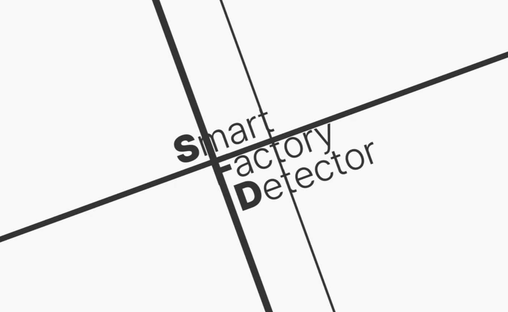
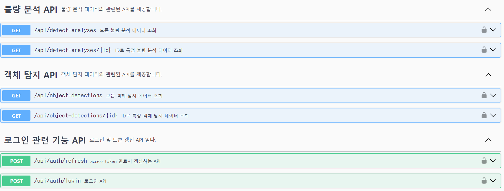

# S.F.D (Smart Factory Detector)

## 💡 UCC

## 🚩 목차

1. 기획 배경
2. 서비스 소개
3. 기능 소개
4. 기술 스택
5. 프로젝트 일정 및 기타 산출물
6. 팀원 소개 및 소감

## ✨ 기획 배경

### 개요

- 한 줄 설명 : 도메인 제한없이 스마트팩토리 공정 프로세스에서 불량품을 탐지하는 프로젝트
- 서비스명 : **S.F.D**

### 목적

- 다양한 도메인을 **한 곳에서**
- 불량품의 불량 **구별**까지
- 대시보드를 통한 **실시간** 상황 파악과 **불량 통계**
- 관리자 페이지를 통한 **보안**
- 시제품을 통한 실제 현업 프로세스를 체험

### 현 상황

- 치열한 경쟁 속에서 살아남기 위한 선택이 아닌 필수 [('선택' 아닌 '필수' 스마트팩토리)①단순 자동화 그 이상 '스마트팩토리'](https://www.newstomato.com/ReadNews.aspx?no=1241653)
- 위험/복잡한 작업 사람대신 기계가 작업 [위험·복잡한 작업 '뚝딱'‥진화하는 스마트팩토리](https://imnews.imbc.com/replay/2024/nw1700/article/6619754_36500.html)

## ✨ 서비스 소개

### 페르소나

- 제조업 현장에서 품질 관리를 담당하는 **문범수**씨
  - **실시간 불량 모니터링**: 생산 라인의 실시간 데이터를 통해 현재 불량률을 지속적으로 확인하고 싶어 한다.
  - **자동 불량 탐지**: 다양한 제품과 공정에서 발생하는 불량을 AI 기반 시스템이 자동으로 탐지하고 싶어 한다.
  - **문제 공유 및 협업**: 불량 사례를 팀원들과 쉽게 공유하고, 공동으로 문제를 분석하여 해결 방안을 모색할 기반이 필요하다.
  - **데이터 기반 의사 결정**: 축적된 데이터를 바탕으로 품질 관리 전략을 최적화하고, 생산 효율성을 높일 수 있는 인사이트를 얻고 싶어 한다.
  - **사용자 친화적 인터페이스**: 직관적인 대시보드와 사용자 인터페이스를 통해 복잡한 데이터를 쉽게 이해하고 활용하고 싶어 한다.
  - **지속적인 학습 및 개선**: AI 모델이 지속적으로 학습하여 새로운 불량 패턴을 인식하고, 품질 관리 능력을 향상시키고 싶어한다.

### 기대효과

- 실시간 모니터링과 자동화된 불량 탐지를 통해 **생산 효율성 향상**
- AI을 통해 다양한 패턴의 불량을 정확하게 식별함으로써, **불량률 낮춤**
- 축적된 생산 데이터를 분석하여 품질 관리 전략을 최적화하고, **더 나은 의사 결정**을 내릴 수 있음
- 도메인에 구애받지 않고 다양한 산업 환경에서 적용 가능한 통합된 불량 탐지 모델을 제공하여, **여러 제조업체의 요구를 충족**

## ✨ 기능 소개

- **대시보드**
  - **0CHA가 추천하는 루틴** : 0CHA가 직접 개발하고 고안한 루틴을 추천합니다.
  - **진행 중인 운동** : 현재 진행 중인 운동이 있는 경우 바로 이동할 수 있습니다.
  - **내 루틴** : 내 루틴을 최신 순으로 보여집니다. 더 보기를 누르면 루틴 목록으로 각 루틴의 상세 정보를 누르면 루틴의 상세 정보를 확인할 수 있습니다.

- **회원가입 & 로그인**
  - **회원가입** : 이메일 인증, 비밀번호, 생년월일, 전화번호, 닉네임 입력 후 가입할 수 있습니다.
  - **로그인 & 로그아웃** : JWT Token을 사용하여 로그인 및 로그아웃이 가능합니다.
  - **소셜 로그인** : Google, Kakao 계정과 연동하여 로그인이 가능합니다.
  - **프로필 수정** : 프로필 이미지와 닉네임을 변경할 수 있습니다.
  - **내 정보 수정** : 내 키와 몸무게 활동 지역을 변경할 수 있습니다.
  - **회원 탈퇴** : 회원 탈퇴 문구 작성 후 탈퇴 가능합니다.

- **관리자 페이지**
  - **운동 목록** : 상단의 부위를 탭하여 해당 부위의 운동 목록을 확인할 수 있습니다.
  - **운동 찜** : 사용자는 별표 버튼을 클릭해 운동을 찜/찜해제 할 수 있습니다.
  - **운동 상세보기** : 운동을 클릭해 각 운동의 운동 예시와 운동 상세정보를 확인할 수 있습니다.
  - **루틴에 운동 추가** : 사용자는 V표를 클릭해 루틴에 추가할 운동을 선택할 수 있고 새 루틴에 추가하기 버튼을 클릭해 새 루틴에 운동을 추가할 수 있습니다.
  - **운동 검색** : 검색창에 검색어를 입력하면 해당 부위에 맞는 운동이 실시간으로 검색됩니다.

## ✨ 기술 스택

- **프론트엔드** : React, TypeScript, Redux-toolkit, styled-components, Stomp, PWA
- **백엔드** : Spring Boot, Spring Security, JWT, Oauth 2.0, FCM
- **인프라** : Docker, Nginx, Jenkins, MySQL, Certbot, EC2, S3
- **AI** : 
- **HW** : 
- **이슈 관리** : JIRA, Mattermost, Notion

### 아키텍처 설계도

## ✨ 프로젝트 일정 및 기타 산출물

### 프로젝트 일정

**전체 일정** : 2024.08.16 ~ 2024.10.11(총 55일)

- **기획** : 2024.08.16 ~ 2024.08.30(총 14일)
- **개발** : 2024.09.01 ~ 2024.10.11(총 41일)

### Git Flow

### 유저플로우

### 피그마 화면 정의서

### ERD

### API 명세서

| [API 명세서](https://past-currant-4d8.notion.site/API-57f2a24c811143dea87f1da52203df55) |                                   |
| :-------------------------------------------------------------------------------------: | :-------------------------------: |
|                                                         |   |
|                                                         |   |
|                                                         |   |
|                                                         |   |
|                                                         |  |
|                                                        |  |

## ✨ 화면

|                                                          |                                                          |                                                          |                                                           |
| :------------------------------------------------------: | :------------------------------------------------------: | :------------------------------------------------------: | :-------------------------------------------------------: |
|                      |                   |          |              |
|                          로그인                          |                         회원가입                         |                    회원 추가정보 입력                    |                        이메일 찾기                        |
|  |              |            |                    |
|                     이메일 찾기 결과                     |                      비밀번호 찾기                       |                      비밀번호 변경                       |                        메인 페이지                        |
|           |  |       |      |
|                       프로필 메인                        |                       내 정보 수정                       |                    프로필 이미지 수정                    |                       비밀번호 수정                       |
|            |          |             |            |
|                        운동 목록                         |                        운동 상세                         |                        루틴 목록                         |                         루틴 상세                         |
|           |               |          |               |
|                      루틴 생성하기                       |                         운동하기                         |                        운동 완료                         |                     기록 메인(캘린더)                     |
|           |            |          |           |
|                       인바디 등록                        |                       인바디 스캔                        |                       인바디 결과                        |                         운동 기록                         |
|              |                    |                   |                   |
|                  AI 트레이너 초기 설정                   |                        운동 대기                         |                         운동 중                          |                     AI 트레이닝 결과                      |
|             |                  |       |        |
|                        SNS 프로필                        |                         SNS 피드                         |                    SNS 피드 작성/수정                    |                       SNS 피드 댓글                       |
|                |     |  |  |
|                         SNS 장터                         |                      SNS 장터 검색                       |                     SNS 장터 글 작성                     |                    SNS 장터 상세 보기                     |
|          |                  |                                                          |                                                           |
|                       SNS 채팅목록                       |                         SNS 채팅                         |                                                          |                                                           |

## ✨ 소감

|                      이름                      |      역할       | 소감                                                                                                                                                                                                                                                                                                                                                                                                                                                                 |
| :--------------------------------------------: | :-------------: | -------------------------------------------------------------------------------------------------------------------------------------------------------------------------------------------------------------------------------------------------------------------------------------------------------------------------------------------------------------------------------------------------------------------------------------------------------------------- |
|   문범수  |    팀장(BE)     | 관통프로젝트 이후 저의 두번째 프로젝트였습니다. 팀장이라는 직책을 맡게 되었고 막막하고 두려웠습니다.   미숙하고 까다로운 팀장과 함께 잘 마무리해준 팀원들, 많은 도움을 주신 컨설턴트님, 코치님들께 너무나도 감사드립니다.   덕분에 잘 마무리할 수 있었다고 생각합니다. 많은 것을 배웠고, 자신감도 얻을 수 있었던 잊지 못할 기간이었습니다.                                                                                                                     |
|    김예현 |     FE     | 프로젝트를 하면서 처음에는 어떻게 해야할까 고민과 걱정이 많았지만 그래도 결과가 나오고 하나씩 적용이 되다보니   뿌듯함도 많이 느꼈습니다. 아마 이번 프로젝트가 졸작때보다 기간때문인지 더 힘들다고 느꼈습니다.   앞으로의 프로젝트도 힘들겠지만 그래도 재미있는 프로젝트들이라서 기대가 됩니다. B310 모두 수고했습니다~                                                                                                                                        |
|   박상천  | 인프라, AI | 짧은 시간 동안 다양한 기능을 프로젝트에 녹여내려는 것이 시간적으로 많이 힘들었지만,   도커 네트워크와 STOMP 등 다양한 것을 얻을 수 있었던 좋은 기회였습니다. |
|    김진기 |     AI      | 많은 걱정을 안고 시작했지만 다들 열심히 하는 모습에서 더 프로젝트에 집중할 수 있었습니다.   기능적으로 완성시키지 못한 부분이 많았는데 이 점을 피드백 삼아 다음 기획에서 반영하고자 합니다.  특히 로그인, 시큐리티같은 시스템 전반의 기초부분에 대해서 먼저 마무리 짓고 시스템을 구축하고 싶습니다.                                                                                                                                                            |
|   복현우  |       AI        | 프로젝트에서 사용되는 기술 스택들 대부분이 처음 접하는 것인 만큼 많은 어려움을 안고 시작했던 프로젝트였습니다.   하지만 동작 과정을 먼저 생각한 후 그에 맞는 코드를 작성하면서 설계와 로직의 중요성을 실감할 수 있었습니다.   또 그 과정에서 백엔드와 프론트엔드의 소통 방식, 서버와의 소통 방식을 배우고 알아가는 재미를 느낄 수 있었습니다.   무엇보다도 팀원들이 작성한 코드가 하나하나 맞물려가며 하나의 프로젝트를 완성한 것에 대해 매우 뿌듯했습니다. |
|   이동복  |       BE, HW        | 2학기 첫 프로젝트로 6명이 진행하는 만큼 규모가 커져서 처음에는 막막했지만 다같이 만들어나가는 과정이 재미있었습니다.   많은 것을 배울 수 있었던 것 같고 다들 남은 2학기도 즐겁게 보냈으면 좋겠습니다                                                                                                                                                                                                                                                              |